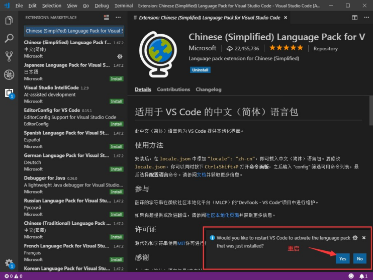
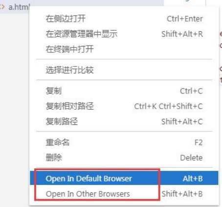
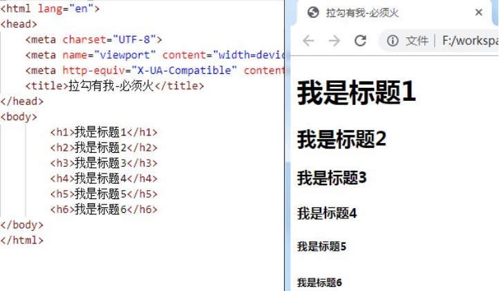
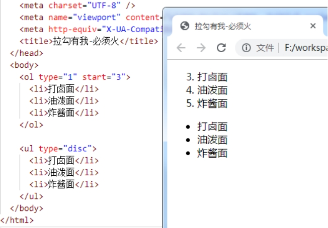
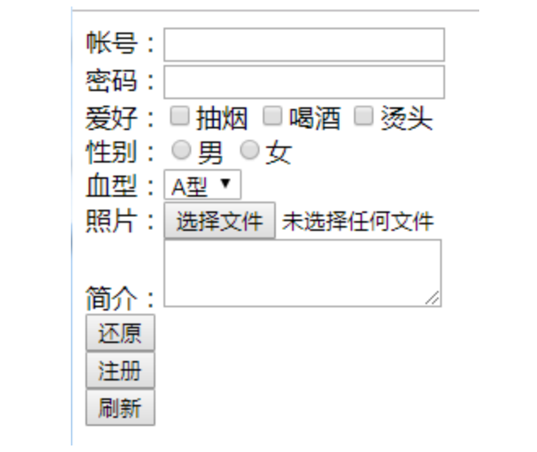
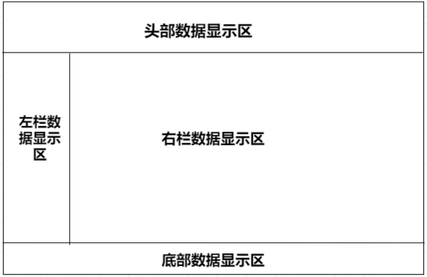
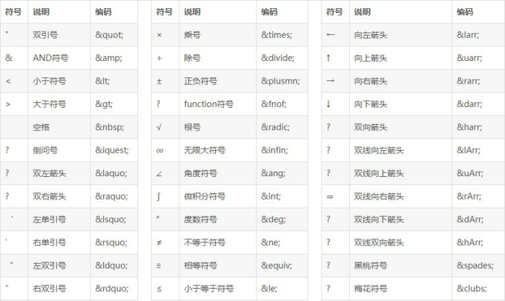
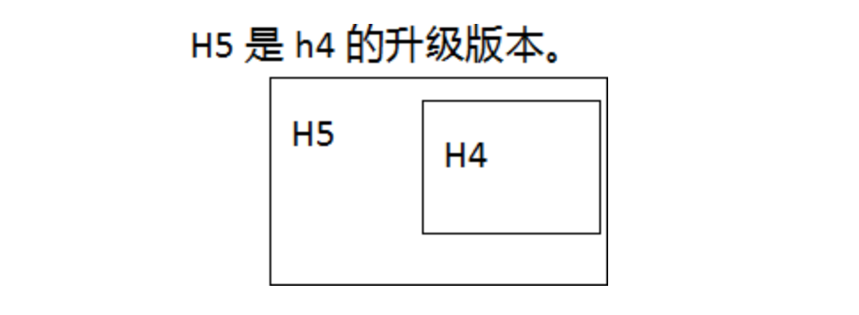
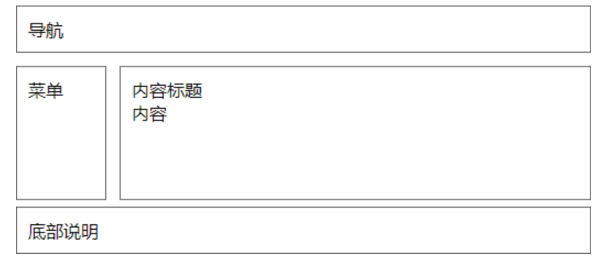

# ***HTML*** ***详解***

```
课程目标
1、HTML 介绍与规范
2、HTML 的使用
3、HTML5新特性
```

 


# **1.** ***HTML******介绍*** ****&规范

## **1.1** ***介绍***

HTML 指的是超文本标记/标签语言 (Hyper Text Markup Language)

专门制作网页的计算机语言

普通的文本就是英文单词，英文字母一样的存在。

超文本的意思是有一些单词或字母，在网页浏览器的世界中被赋予了特殊的权利。

比如：我们都是普通人，但是有些人经过国家的选拔，穿上警服之后，他就被赋予了执法的特殊权利，  普通人是没有执法权的。

字母img只是普通的字母，没什么特殊的含义。而被加上尖括号后，在网页的世界中，就具备了显示图片的作用。

## **1.2** ***使用记事本开发第一个网页***

在计算机任意的位置，创建一个空白的记事本重点：文件的后缀名必须是 "htm" 或 "html"

鼠标右键文件，选择打开方式为"记事本"，输入下面代码

```html

<html>
  <head>
    <title>拉钩有我</title>
  </head>
   <body>
         必须火！
   </body>
</html>
```

保存文件，双击文件会以计算机默认的浏览器运行，你的第一个网页就制作完成了！

**注意：**

1. <html>标签它代表当前页面是一个HTML

2. 2. <head>标签中可以声明HTML页面的相关信息

3. <body>标签中它主要是用于显示页面信息

4. 标签要有开始，有结束，**成双成对**

5. 开始标签与结束标签中的内容是标签的内容，如果没有标签内容，可以让标签自关闭<br/>

6. 大多数标签它具有属性,属性值要使用引号引起来。

7. HTML它本身是不区分大小写的。

## **1.3** ***下载和安装*** ***VSCode***

记事本编写网页太难了，我们推荐一款编写网页的神器！

### **1.3.1** ***下载地址***

[h ttps://code.visualstudio.com/](https://code.visualstudio.com/)

### **1.3.2** ***\*初始中文设置\****

安装vscode之后，在界面的左侧，选择安装中文插件。

 

点击安装后，右下角会弹出重启的窗口

 

重启之后，界面就是伟大的中文了。

### **1.3.3** ***\创建项目***

vscode本身没有新建项目的选项，所以要先创建一个空的文件夹，如: vscode目录

然后打开vscode软件，在vscode软件中选择 File -> Open Folder 打开刚才创建的文件夹右键目录，创建子目录lagou-html，在lagou-html目录下创建文件，输入Test1.html

在代码编辑区，最上面输入！回车，就是见证奇迹的时刻

### **1.3.4** ***运行页面***

需要安装插件 “open in browser ”

 


安装完插件，右键想要运行的页面文件，或者 使用快捷键 alt+b


 

在这里推荐使用chrome谷歌浏览器，精简，速度快。先安装好chrome浏览器

修改默认的浏览器：首页的设置


 


 

添加代码

```
"open-in-browser.default":"chrome"
```

保存成功后，使用默认浏览器打开页面就是chrome了，当然你也可以修改成自己喜欢的浏览器，比如火狐等

### **1.3.5** ***修改软件主题颜色***

文件 -> 首选项 -> 颜色主题

字体大小：文件 -> 首选项 -> 设置 -> 文本编辑器 -> 字体

# **2.** ***HTML******的使用***

## **2.1** ***文件标签***

```
<html> 标签： 代表当前书写的是一个HTML文档

<head>标签：存储的本页面的一些重要的信息，它不会显示

<head>标签：有一个子标签<title>它是用于定义页面的标题的

<body>标签：书写的内容会显示出来

<body>标签的属性
    
     1. text 用于设置文字颜色

     2. bgcolor 用于设置页面的背景色

     3. background 用于设置页面的背景图片
```


|      |                                    |
| ---- | ---------------------------------- |
|      |  |

## **2.2** ***排版标签***

### **2.2.1** **HTML**注释


 


### **2.2.2** **换行标签**

```
<br/>
```

 标签就是一个换行（回车）功能标签，标签中的 / 可有可无的。有/是html语言的标准化，但是html语言是一门不那么严谨的语言

### **2.2.3** ***段落标签***

在<p>标签中的内容,会在开始与结束之间产生一个空白行，并且它会自动换行.  常用属性 align 它的作用是设置段落中的内容对齐方式 可取值有 left    right     center

 

### **2.2.4** ***水平线标签***

<hr>标签会在页面上产生一个水平线对于hr标签它有常用属性:

align：可取值有left right center 代表水平线位置

size： 代 表 水 平 线 厚 度 （ 粗 细 ）   

width：代表水平线宽度

color：水平线的颜色


 


单位：size="5"，5是默认的单位，为"像素"/"像素点"，像素就是构成计算机图片的最小单位！    也可以使用百分比，size="50%"

### **2.2.5** ***分区标签***

div是一个**块**标签，用来进行布局的

普通的div并没有什么效果，肉眼也看不见，但div与CSS结合，就会更好对页面进行排版

div与span都是“容器”的作用，具体区别:

- div会自动换行，我们也叫这样的标签为块级元素
- span标签它不会自动换行，我们也叫它为行内元素
- div：整体划分区块
- span：局部划分

 

上图，两个div的区别是显而易见的，后面我们再具体学习css语法

## **2.3** **字体标签**

### **2.3.1** ***字体标签***

- <font>标签可以设置字体，字的大小及颜色，常用属性： face:用于设置字体，例如 宋体 隶书 楷体
- size:用于设置字的大小（大小默认设置1-7，7最大，想更大，往后学css即可）
- color:用于设置字的颜色

注：

我们所看到的屏幕上所有的颜色都是由红、绿、蓝这三种基色调混合而成的。

每一种颜色的饱和度和透明度都是可以变化的，用0～255的数值来表示。如纯红色表示为（255，0，0） ，十六进制表示为#FF0000。

按这种表达方式，理论上我们可以得到256 * 256 * 256 = 16777216种颜色。

1. 使用十六进制方式，取值范围 #000000 ~ #FFFFFF （黑色到白色）。当颜色值为#cc3300 时，可简化成 #c30 这种方式

```
<body bgcolor="#666">
```

2. RGB颜色表示法：RGB（x,y,z）。x、y、z是0 ～ 255之间的整数。rgb字母大小写无所谓

```
<body bgcolor="rgb(11,11,11)">
```

|      |                                    |
| ---- | ---------------------------------- |
|      |  |

（在线颜色选择器： [http://www.86y.org/code/colorpicker/color.html ](http://www.86y.org/code/colorpicker/color.html)）

百度搜索：字魂网，下载一个免费的字体，并安装到计算机中。在我们的网页中显示出来！

### **2.3.2** ***标题标记***

给一段文字起一个标题

<h1>	<h6>

h1最大 h6最小，它们代表的是标题，

自动换行，字体加粗，标题与标题之间产生一定的距离

注意:在HTML中允许标签进行嵌套的，但是一般都包裹嵌套，而不可以进行交叉嵌套


 

### **2.3.3** ***格式化标签***

- <b>：字体加粗
- <i>：字体倾斜
- <del>：删除线

- <u>：下划线

  


## **2.4** ***列表标记***

#### ***ol******：有序列表***

- type='A'：字母排序
- type='I'：罗马排序
- start=“3” 序列从几开始

- #### ***ul******：无序列表***


type="disc"：默认，实心圆

type="square"：方块

type="circle"：空心圆


 

## **2.5** ***图像标签***

它可以让我们在网页引入一张图片，常用属性：

1. src 代表的图片的路径

2. width 图片的宽度

3. height 图片的高度

4. border 用于设置图片的边框

5. alt 如果图片不可以显示时，默认显示的文本信息

6. title鼠标悬停图片上，默认显示的文本信息

7. align 图片附件文字的对齐方式，可取值有

- left：把图像对齐到左边
- right：把图像对齐到右边
- middle：把图像与中央对齐
- top：把图像与顶部对齐
- bottom：把图像与底部对齐（默认）


## **2.6** **超连接标签**

<a>标签,可以实现跳转到其它页面操作.

超链接内容不仅可以是文本，也可以是图片等信息常用属性:

1. href 代表的我们要跳转的路径

2. target 这个属性规定在何处打开这个链接文档，可取值：

- _ blank 在**新窗口**中打开页面

- _ self 默认。在**本窗口**打开页面


 


功能性连接：

1. 发邮件

```
<a href="mailto:sunguoan@163.com">联系站长</a>
```

2. QQ聊天窗口

```
<a href="tencent://message/?uin=19998539&Menu=yes">
   
</a>
```

## **2.7** ***表格***

<table>：定义一个表格
- border：边框，取值是像素为单位
- width 代表的表格的宽度

- align 代表表格的对齐方式；取值


​            left 左对齐表格

​           right 右对齐表格

​           center 居中对齐表格

cellspacing：单元格间距（通常设置0表示单线表格）

**th**：这是表头，也就是每一列的标题（table head）。

**th**与**td**的区别是：**th**内部的文本样式为**居中+粗体**，**td** 内的文本样式为**左对齐+普通文本**

valign 属性规定单元格中内容的垂直排列方式。

valign属性趋向于垂直对齐，其值包含：top（对内容进行上对齐）、bottom（对内容进行下对齐）、middle（对内容进行居中对齐）、baseline（与基线对齐）

<tr>：表格中的行 （Table Row） align 代表表格的对齐方式；取值

- left 左对齐内容（默认值）

- right 右对齐内容

- center 居中对齐内容（th 元素的默认值）


<td>：表格中的数据单元格 （Table DataCell）

- ​     colspan 指示列的合并

- rowspan 指示行的合并

## **2.8** ***表单标签***

表单可以让我们将录入信息携带到服务器端。

简单说，通过表单可以将要提交的数据提交到指定的位置。

但一个一个的提交，不方便。表单正好解决了这个问题，将所有的数据形成一个整体，一起提交给服务  器。

常见的 登录页面、注册页面 都离不开表单的应用

 

### **2.8.1** ***form******属性***

action：整个表单提交的目的地method：表单提交的方式

- get：提交时，传输数据量少（传递普通文字信息，传递照片会失败），明文提交（在浏览器的url


后面会显示提交的数据，不适合用于登录）

- post：提交时，传输数据量大（传递文字和图片都行），密文提交（浏览器的url后面看不到提交的数据）


### **2.8.2** ***表单中的元素******(******控件******)***

```
<input> 元 素 的 type 属 性   text：默认值，普通的文本输入框
placeholder属性：提示文本maxlength属性：最多能输入字符数量
password：密码输入框
checkbox：多选框/复选框
checked：被选中
radio：单选按钮
file：上传文件
reset：重置按钮
submit：提交按钮
button：普通按钮
<select>
  <option>：列表中的项
     selected：被选中
```

***value 属性规定在表单被提交时被发送到服务器的值。***

*\<option> 与 <option/> 之间的值是浏览器显示在下拉列表中的内容，而 value 属性中的值是表单被提交时被发送到服务器的值。\**

***注释：如果没有指定 value 属性，选项的值将设置为 <option> 标签中的内容。***

```
<textarea>：文本域（多行文本框）
可以通过 cols 和 rows 属性来规定 textarea 的尺寸，不过更好的办法是使用 CSS 的height 和 width 属性。
<button>：按钮
在form表单中，作用和submit一样
不在form表单中，就是普通按钮（配合后期的javascript，可扩展性更高）
```


```html
<form action="baidu" method="GET">

<p>帐号：<input name="a" type="text" placeholder="请输入帐号..." maxlength="5" ></p>
<p>密码：<input name="b" type="password"></p>
<p>爱好：
<input name="hobby" type="checkbox"> 抽烟
<input name="hobby" type="checkbox" checked="checked"> 喝酒
<input name="hobby" type="checkbox"> 烫头
<input name="hobby" type="checkbox"> 泡澡
</p>
<p>性别：
<input type="radio" name="sex"> 男
<input type="radio" name="sex" checked="checked"> 女
</p>
<p>身份：
<input type="radio" name="role"> ceo
<input type="radio" name="role"> cto
<input type="radio" name="role"> coo
<input type="radio" name="role" checked="checked"> ufo
</p>
<p>头像：
<input type="file">
</p>
<p>血型：
<select>
<option>A型</option>
<option>B型</option>
<option>C型</option>
<option selected="selected">O型</option>
</select>
</p>
<p>个人简介：
<textarea cols="10" rows="5"></textarea>
</p>
<p>
<input type="reset" value="清空">
<input type="submit" value="提交">
<input type="button" value="取消">
<button>保存</button>
</p>
</form>

<button>测试</button>
```

注意事项：

1. 所有表单中的元素都要具有名称（否则提交到服务器之后，服务器无法区识别多个元素之间的不 同）

2. 单选框要想可以一次只选择一个，要具有相同的name值

3. 所有的复选框以组为单位，组内的每个复选框都应该具有相同的name值

## **2.9** ***框架标签***

通过<frameset>和<frame>框架标签可以定制HTML页面布局。可以理解为：用多个页面拼装成一个页 面。

注意，框架标签和body标签不共存。“有你没我，有我没你”


 


```html
<!DOCTYPE html>
<html lang="en">
<head>
<meta charset="UTF-8">
<meta name="viewport" content="width=device-width, initial-scale=1.0">
<meta http-equiv="X-UA-Compatible" content="ie=edge">
<title>Document</title>
</head>
<frameset rows="10%,*,13%">
<frame src="top.html"></frame>
<frameset cols="15%,*">
<frame src="left.html"></frame>
<frame src="right.html"></frame>
</frameset>
<frame src="foot.html"></frame>
</frameset>
</html>
```

 

top.html、left.html、right.html、foot.html 四个页面内容一样，稍微改下文字而已，以top.html为例

```html
<!DOCTYPE html>
<html lang="en">
<head>
<meta charset="UTF-8">
<meta name="viewport" content="width=device-width, initial-scale=1.0">
<meta http-equiv="X-UA-Compatible" content="ie=edge">
<title></title>
</head>
<body>
<h1>顶部导航区域</h1>
</body>
</html>
```

## **2.10** ***其它标签与特殊字符***

### **2.10.1** <meta>标签

<meta>标签必须写在<head>标签之间.

```
<meta charset="UTF-8">
<meta name="viewport" content="width=device-width, initial-scale=1.0">
<meta http-equiv="X-UA-Compatible" content="ie=edge">
```

1. 当前页面的字符编码 gbk：中文简体

2. 这里 的 名字 是 viewport （显示窗口）

数据是文本内容 content="width=device-width, initial-scale=1.0"

也就是显示窗口 宽度 是 客户端的 屏幕 宽度 （就是 满屏 ！），显示的文字和图形的初始比例 是

1.0

3. 每个电脑内置的IE版本是不一样的，为了兼容所有的版本以最高级模式渲染文档，也就是任何IE版本都以当前版本所支持的最高级标准模式渲染

- 通过meta标签来设置页面加载后在指定的时间后跳转到指定的页面


```html
<meta http-equiv="refresh" content="5; url=http://www.lagou.com">
```

注意：在html中如果跳转的互联网上的网站资源，那么我们在书写路径时，一定要带协议的路径。

### **2.10.2** ***<link>******标签***

后面我们会使用link标签来导入css

注意:link标签也必须写在<head>标签中。

### **2.10.3** ***\*特殊字符\****


 


 


# **3.** **HTML5**新特性

## **3.1** **HTML4**与****HTML5****的区别

H5包含h4

 

1. 大小写不敏感

(1) 标签

(2) 属性

(3) 属性的值

```html
<inPUT tYPe="pasSWord"/>
```

2. 引号可省略

```html
<input type="password">
<input type=password> 
```

3. 省略了结尾标签

```html
<p>哈哈哈哈哈哈哈
<p>哈哈哈哈哈哈哈
```

说是省略，其实运行起来，查看源代码，html是自动帮我们补全了

## **3.2** ***新增语义化标签***

html4中，所有的容器标签95%都会使用div，div过多的话，很难区分彼此  新增许多语义化标签，让div“见名知意”

- section标签：表示页面中的内容区域，部分，页面的主体部分
- article标签：文章
- aside标签：文章内容之外的，标题
- header标签：头部，页眉，页面的顶部
- hgroup标签：内容与标题的组合
- nav标签：导航

- figure标签：图文并茂

- foot：页脚，页面的底部


 

## **3.3** ***媒体标签***

想在网页上播放视频，就要使用<video>，属性有：

- src：媒体资源文件的位置
- controls：控制面板
- autoplay：自动播放（谷歌失效，360浏览器可以） 
- loop：循环播放

## **3.4** ***新增表单控件***

表单的控件更加丰富了

<input>，修改type属性： 

color：调色板

date：日历

month：月历

week：周历

number：数值域

min：最小值（默认值是1）

 max：最大值（默认值无上限）

 step：递增量

range：滑块

search：搜索框（带×号，可一键删除框中内容） 进度条<progress/>

高亮<mark>

联想输入框<datalist> （模糊查询） 选项<option>